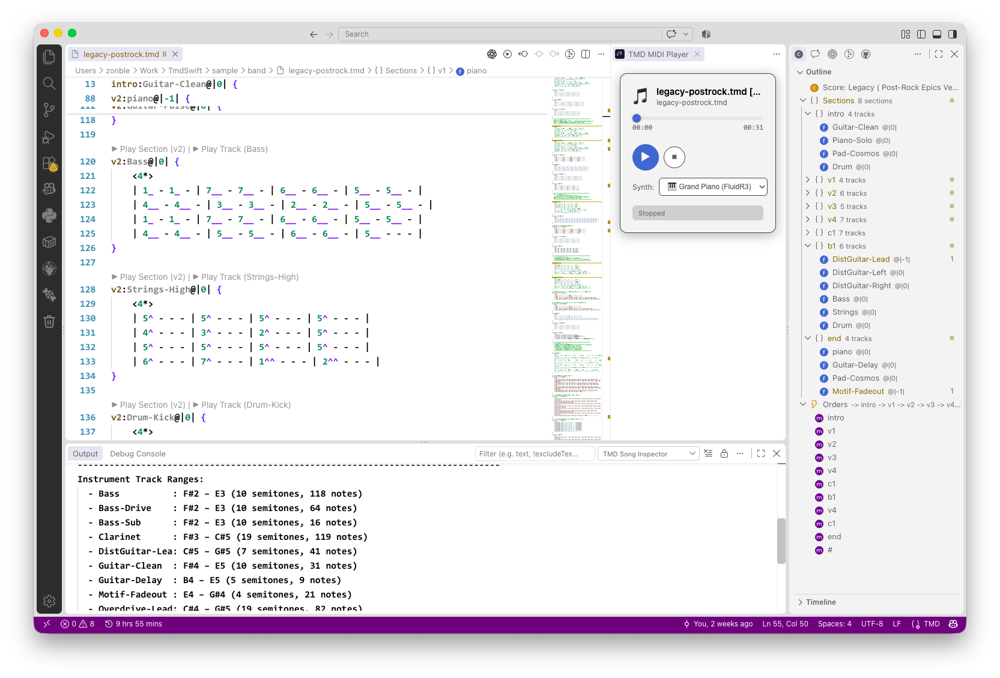

# TmdSwift

A modern Swift implementation of the **TMD** (Timebase Mark Down) markup language parser, toolkit, and music notation exporter.



In memory of **Chen, Chih-Han / [aguai](https://github.com/aguai)** (阿怪, 1974–2019).

Original project: [https://github.com/aguai/TMDLang](https://github.com/aguai/TMDLang)

## The Markdown of Music

### Origins & Heritage

**TMD** (Timebase Mark Down) was originally conceived and designed by the celebrated Taiwanese songwriter, composer, and producer **Chen, Chih-Han / [aguai](https://github.com/aguai) (阿怪, 1974–2019)**, renowned for Mandopop classics such as A-Mei's 《三天三夜》 (*Three Days and Three Nights*).

### Designed for Songwriters, Not Print Shops nor Archives

Just as **Markdown** freed writers from the tedious tags of HTML, **TMD (Timebase Mark Down)** brings that same simplicity to music.

Existing musical formats serve other masters: **DAWs** treat music as audio engineering (faders, millisecond waveforms); **Engravers** (LilyPond, Sibelius) focus on printing layout; and **ABC notation** was designed decades ago to archive folk melodies. Their workflow assumes the song is already finished on paper. Furthermore, in multi-instrument arrangements, ABC quickly devolves into "rest hell" (`| z4 | z4 |`), cluttering the page and exhausting LLM context windows.

**TMD moves the songwriter's creative notebook directly onto the computer—making it effortlessly mutable and AI-ready.**

Conceived by pop composer **aguai (阿怪)**, TMD reflects how songwriters actually create: humming in movable-do, auditioning chords, testing vocal ranges, and rearranging song blocks on the fly. As a music-native Intermediate Representation (IR), it provides:

- **Zero "Rest Hell"**: Instruments enter with measure offsets (`verse:Guitar@|+4|{ ... }`). Unused tracks in a section are simply omitted—no filler tokens, no empty measures.
- **Modular Blocks & Road Maps**: Sections (`intro`, `verse`, `chorus`) are defined once and arranged into a playback execution flow (`-> intro -> verse -> chorus -> {?+1} -> chorus ->#`), enabling instant MIDI/audio preview of isolated sections or solo tracks.
- **Movable-Do (Jianpu) Thinking**: Melodies use numbered scale degrees (`1`–`7`). Transposing for a singer's vocal range is as simple as changing `?= C` to `?= Eb`—the melody notes never need rewriting.
- **Built-in Typechecking & Diagnostics**: `tmd check` verifies measure beat math like a compiler linter, while `tmd inspect` acts as a profiler—analyzing vocal tessitura (highest/lowest notes), song timeline ratios, and arrangement density.

Yet because of its structural purity, a `.tmd` score compiles cleanly to virtually any downstream format: **MIDI**, **REAPER (.rpp)**, **MusicXML**, **LilyPond (.ly / .pdf)**, **ABC**, **VOCALOID**, **UTAU**, or **WAV audio**.

## Co-Composing with AI Using TMD

Because TMD is concise, human-readable, and free of syntactic noise, it serves as the ideal shared language between creators and Large Language Models (LLMs). While AI can generate valid LilyPond or MusicXML, those formats are hostile to human reading and editing. TMD balances expressive power with human readability, allowing creators and AI agents to pair-program music interactively.

### Equip Your AI Assistant in One Command

`TmdSwift` comes with an official AI Agent skill (`SKILL.md`) covering TMD syntax, modular section chunking, human composition principles, motif development, and counterpoint rules. You can install it directly into your local AI environment (supporting Codex, Claude Code, Antigravity, and Gemini):

```bash
tmd --install-skills
```

### What AI Can Help You Achieve

1. **Arranging Accompaniments from Melody**:
   Draft a vocal line or melody in TMD, then prompt the AI to generate supporting tracks (bass lines, rhythm guitar grooves, string pads, or drum patterns) with specific entry offsets (`@|+4|`).

2. **Motif Development & Continuation**:
   Define a short 2-bar or 4-bar melodic motif, and let the AI develop it into complete phrases through inversion, retrograde, rhythmic variations, or antecedent-consequent question-and-answer phrasing.

3. **Re-Harmonization & Chord Exploration**:
   Provide a melody and have the AI propose multiple chord progressions—from standard pop and rock progressions to modal jazz substitutions and Neo-Soul extensions (`[Cmaj7]`, `[Am7]`, `[Dm7-5]`).

4. **Macro Song Structuring & Modulations**:
   Compose core song blocks (`intro`, `verse`, `chorus`, `bridge`) and have the AI plan the overarching playback sequence (`-> intro -> A -> B -> {?+1} -> B ->#`), complete with key modulations and emotional dynamics.

5. **Textural Layering & Dynamic Contrast**:
   Use measure entry offsets (`@|0|`, `@|+4|`, `@|-1|`) to guide the AI in orchestrating gradual instrumentation build-ups, pick-up measures (anticipation notes), and dynamic contrast across sections.

6. **Style & Metric Variations**:
   Prompt the AI to adapt a 4/4 ballad into a 3/4 waltz, re-groove straight rhythms into syncopated Funk/R&B patterns, or add tuplet ornaments `(1 2 3)%(--)`.

See [`docs/AI-Co-Composing-With-TMD.md`](docs/AI-Co-Composing-With-TMD.md) for concrete workflows, step-by-step examples, and copy-pasteable prompt templates.

## Automated Refactoring & Macro Song Inspection

Beyond AI pair-programming, TMD provides automated tools tailored for the real-world songwriting and arranging process:

- **Song Inspector (`tmd inspect`)**: Analyzes vocal tessitura (exact highest/lowest notes and semitone span to verify whether a singer can hit the notes), song section timing (seconds and measures), chord vocabulary, and peak arrangement density. Supports `--json` for dashboards and automated pipelines.
- **Score Refactoring Suite (`tmd refactor`)**: Perform safe, scriptable musical transforms in seconds—scale rhythm grids (`double-grid` / `halve-grid`), rename instruments or sections globally, extract isolated tracks, duplicate melodies with octave shifts, generate parallel diatonic harmonies, or inline repeating orders into a linear score.

## Platform Support

| Platform | Parser & AST (`TmdSwift`) | MIDI Exporter (`TmdMIDI`) | MusicXML (`TmdMusicXML`) | LilyPond (`TmdLilyPond`) | ABC (`TmdABC`) | WAV Audio (`TmdAudio`) |
| :--- | :---: | :---: | :---: | :---: | :---: | :---: |
| **macOS** | ✅ | ✅ | ✅ | ✅ | ✅ | ✅ *(Built-in Roland GS DLS / Custom SF2)* |
| **Linux (Ubuntu)** | ✅ | ✅ | ✅ | ✅ | ✅ | ⚠️ *(Requires external synth / planned)* |
| **Windows** | ✅ | ✅ | ✅ | ✅ | ✅ | ⚠️ *(Requires external synth / planned)* |
| **iOS / iPadOS** | ✅ | ✅ | ✅ | ✅ | ✅ | ✅ *(CoreAudio / Custom SF2)* |

## Installation & Build

Requires Swift 6.0+ / Xcode 16+.

### Install on macOS / Linux from Homebrew tap

```bash
brew tap zonble/tmd
brew tap --trust zonble/tmd  # allow this third-party tap
brew install tmd
```

If Homebrew refuses to install from an untrusted third-party tap, run the `brew tap --trust zonble/tmd` line and install again.

On Linux, the Homebrew formula builds `tmd` with Homebrew's `swift` package (`brew install swift`). Without Homebrew, install Swift 6 from your distribution or Swift.org.

### Using Mint

You can install the `tmd` CLI tool via [Mint](https://github.com/yonaskolb/Mint):

```bash
mint install zonble/TmdSwift
```

### Build from Source

```bash
git clone https://github.com/zonble/TmdSwift.git
cd TmdSwift
swift build -c release
```

## CLI Usage (`tmd`)

The `tmd` CLI tool provides comprehensive score compilation, export, verification, inspection, and refactoring commands:

### Compilation, Export & Rendering

```bash
# Parse and print score summary
tmd sample/basic/三天三夜.tmd -p

# Play score in terminal using macOS default sound bank
tmd sample/basic/三天三夜.tmd --play

# Export to Standard MIDI file (.mid)
tmd sample/basic/三天三夜.tmd -m score.mid

# Export to REAPER project (.rpp) with tempo and section markers
tmd sample/basic/三天三夜.tmd -r score.rpp

# Export to MusicXML 4.0 (for MuseScore, Sibelius, Finale, Dorico)
tmd sample/basic/三天三夜.tmd -x score.musicxml

# Export to LilyPond (.ly) source file or render directly to PDF
tmd sample/basic/三天三夜.tmd -l score.ly
tmd sample/basic/三天三夜.tmd --pdf-output score.pdf

# Export to ABC notation (.abc) for web score sharing (abcjs)
tmd sample/basic/三天三夜.tmd -a score.abc

# Export vocal track to VOCALOID (.vsq, .vsqx) or UTAU (.ust)
tmd sample/basic/三天三夜.tmd --vsqx-output score.vsqx
tmd sample/basic/三天三夜.tmd -u score.ust

# Render to offline WAV audio file (macOS built-in DLS or custom SoundFont)
tmd sample/basic/三天三夜.tmd -w score.wav
tmd sample/basic/三天三夜.tmd -w score.wav --soundfont /path/to/soundfont.sf2
```

### Inspection, Diagnostics & AI Skills

```bash
# Check measure consistency (detect beat count discrepancies between bar lines '|')
tmd check sample/basic/三天三夜.tmd

# Inspect song profile (vocal tessitura, pitch ranges, duration, chord vocabulary, density)
tmd inspect sample/basic/三天三夜.tmd

# Inspect song profile in structured JSON format
tmd inspect sample/basic/三天三夜.tmd --json

# Generate document symbol outline (sections and tracks with line/col offsets)
tmd outline sample/basic/三天三夜.tmd

# Install TMD skill definition into local AI agent environments (Codex, Antigravity, Claude, etc.)
tmd --install-skills
```

### Formatting & Refactoring

```bash
# Format score with standardized indentation, spacing, and preserved comments
tmd format sample/basic/三天三夜.tmd -i

# Double grid resolution (<4*> -> <8*>) padding units with ties
tmd refactor double-grid sample/basic/三天三夜.tmd -i

# Halve grid resolution (<8*> -> <4*>) collapsing ties
tmd refactor halve-grid sample/basic/三天三夜.tmd -i

# Rename instrument or section globally across paragraphs and orders
tmd refactor rename-instrument sample/basic/三天三夜.tmd --source "Piano" --target "Keys" -i
tmd refactor rename-section sample/basic/三天三夜.tmd --source "verse" --target "A" -i

# Duplicate track with optional octave transposition
tmd refactor duplicate-track sample/basic/三天三夜.tmd --source "Lead" --target "LeadOct" --octave 1 -i

# Generate parallel diatonic harmony for an instrument (e.g. 3rd above: interval 2)
tmd refactor generate-harmony sample/basic/三天三夜.tmd --source "Vocal" --target "Harmony" --interval 2 -i

# Unroll / inline playback orders into a linear score
tmd refactor inline-orders sample/basic/三天三夜.tmd -i
```

## Swift Package Usage

Add `TmdSwift` to your `Package.swift`:

```swift
dependencies: [
    .package(url: "https://github.com/zonble/TmdSwift.git", branch: "main")
]
```

Then import the modules:

```swift
import TmdSwift
import TmdMIDI
import TmdMusicXML
import TmdLilyPond
import TmdABC

// Parse TMD from file or URL
guard let sheet = try TmdParser.parse(filePathOrURL: "sample/basic/三天三夜.tmd") else {
    fatalError("Failed to parse")
}

// Inspect summary
print(sheet.summary())

// Export to MIDI Data
let midiData = TMDMIDIGenerator.generateMIDI(from: sheet)

// Export to MusicXML string
let musicXML = TMDMusicXMLGenerator.generateMusicXML(from: sheet)

// Export to LilyPond string
let lilyPond = TMDLilyPondGenerator.generateLilyPond(from: sheet)

// Export to ABC notation string
let abc = TMDABCGenerator.generateABC(from: sheet)
```

## The TmdSwift Implementation

**TmdSwift** re-implements the original parser into a clean, modern Swift architecture featuring:
- A two-stage Lexer + TokenParser pipeline.
- Normalized musical AST structures (`Beat`, `Note`, `Unit`, `Section`, `Paragraph`, `Order`, `Sheet`).
- Formatter to serialize AST back to standard TMD syntax.
- Exporters for MIDI, REAPER, MusicXML, LilyPond, ABC, VOCALOID, UTAU, and WAV audio.
- A command-line interface (`tmd`) powered by `swift-argument-parser`.

## Modules

- **`TmdSwift`**: Lexer, Parser, AST data structures, and TMD source formatter.
- **`TmdMIDI`**: Binary SMF Type 1 multi-track MIDI file generator.
- **`TmdMusicXML`**: W3C MusicXML 4.0 Partwise generator.
- **`TmdLilyPond`**: LilyPond engraving source generator.
- **`TmdABC`**: Standard ABC Notation (v2.1+) generator.
- **`TmdAudio`**: Offline WAV audio synthesizer using CoreAudio / DLS SoundFont.
- **`TmdSkill`**: AI agent skill definitions and automated installation utilities for AI co-pilots.
- **`TmdUtils`**: Cross-platform file path normalizer and character encoding detector.
- **`TmdCLI`**: Command-line interface executable (`tmd`).

## Editor Support

You can edit TMD files with syntax highlighting, snippets, and export tools in both desktop and terminal editors:

### 1. Visual Studio Code

The repository includes an official VS Code extension in [`editor/vscode`](editor/vscode):

- **Syntax Highlighting & Snippets**: Full grammar for TMD metadata, tracks, numbered notation, chords, tuplets, and arrangement flow.
- **Interactive Web MIDI Player**: Built-in Web MIDI player panel with SoundFont selection, play/stop controls, and position scrub bar.
- **Outline & Breadcrumb Navigation**: Explorer sidebar tree view displaying all sections, track counts, and execution orders with inline section/track play buttons.
- **CodeLens In-Editor Audition**: Click `▶ Play Section` or `▶ Play Track` directly above paragraph headers to preview individual sections or solo instruments on the fly.
- **Measure Consistency Diagnostics**: Real-time linter checking beat count math against time signatures on save and as you type, reporting issues in the Problems panel.
- **Song Inspector**: Run `TMD: Inspect Song Profile` to display vocal tessitura, pitch ranges, duration, chord vocabulary, and arrangement density directly in an Output Channel.
- **In-Editor Score Refactoring**: Interactive commands to double/halve rhythm resolution, duplicate tracks with octave shifts, generate natural harmonies, rename instruments/sections globally, or inline orders.
- **GitHub Copilot Chat & LM Tools**: Chat participant `@tmd` (`/check`, `/inspect`, `/compose`, `/fix`, `/explain`) and language model tools (`tmd_check`, `tmd_inspect`, `tmd_format`, `tmd_get_specification`).
- **Export & Render Commands**: Export to MIDI, REAPER, MusicXML, ABC, LilyPond, PDF, VOCALOID (.vsq, .vsqx), UTAU (.ust), or offline WAV audio.

To install locally:
```bash
ln -s "$(pwd)/editor/vscode" ~/.vscode/extensions/tmd-vscode
```

### 2. zago (Terminal Editor with Native TMD Integration)

[**zago**](https://github.com/zonble/zago) is a modern modal terminal editor (with Web & desktop editions) that provides first-class native TMD score support:
- **Real-time TMD Playback**: Press `Ctrl+P` or use `:tmd play` to preview scores directly within the terminal or browser (via Web MIDI / JZZ synth).
- **Export Menu & Shortcuts**: Press `Ctrl+E` or run `:tmd export <format>` to export to MIDI, MusicXML, ABC, LilyPond, PDF, or WAV on the fly.
- **Syntax Highlighting**: Dedicated TMD syntax highlighting and buffer status notifications.

## Documentation & Language Specification

For the formal TMD language specification implemented in TmdSwift, please refer to:
- English: [`docs/TMD-Language-Specification.en.md`](docs/TMD-Language-Specification.en.md)
- Traditional Chinese: [`docs/TMD-Language-Specification.zh-TW.md`](docs/TMD-Language-Specification.zh-TW.md)

Historical draft notes and original design concepts are preserved in [`docs/Band-Score.syntax.zh_TW.md`](docs/Band-Score.syntax.zh_TW.md).

## License

MIT License
